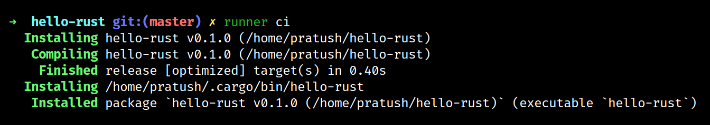
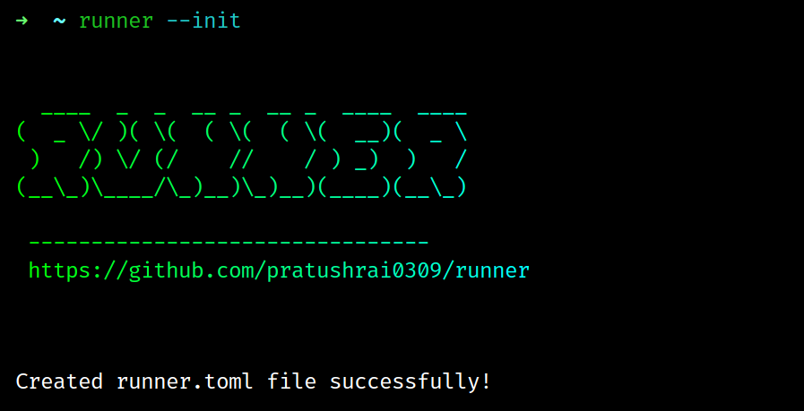

# Runner

## 🤔 What is this?
A cli tool that let's you map commands to a shorter alias. Run the mapped command using the <ALIAS_NAME>.
 Inspired by npm scripts.

```
runner <ALIAS_NAME>
```
An example runner.toml file:
```toml
[Command]
alias = "ci"
program = "cargo"
args = "install --path ."

[Command]
alias = "nv"
program = "node"
args = "-v"

[Command]
alias = "cc"
program = "cargo"
args = "check"

```
### An example run for [ci] alias
### Output: 


## Installation
```
cargo install runner-cli
```

## Initialize

### It will initialize a empty runner.toml file in config directory

```
runner --init
```
### Output:



## Config

### Get the path to runner.toml file by running runner with config option
```
runner --config
```

## Mappings

### Get all the user mapped alias

```
runner --mapping
```
### Output: 


## Options:

```
    -c, --config     Path of the the config file runner.toml
    -h, --help       Print help information
    -i, --init       Initialize a empty runner.toml file
    -m, --mapping    Show all the user defined mappings
    -V, --version    Print version information
```

## TOML file guide:

## Each command starts wtih a [Command] key


```toml
[Command]
alias =  "Shorter subcommand you want to use instead of the command"
program = "CLI Program Name(like: git, cat, batcat, code, neofetch, cargo, python, node, npm etc.)"
args = "Arguments you want to pass to the cli program"
```

## Contribution
### Have any suggestion or feature idea/request feel free to open a issue.
